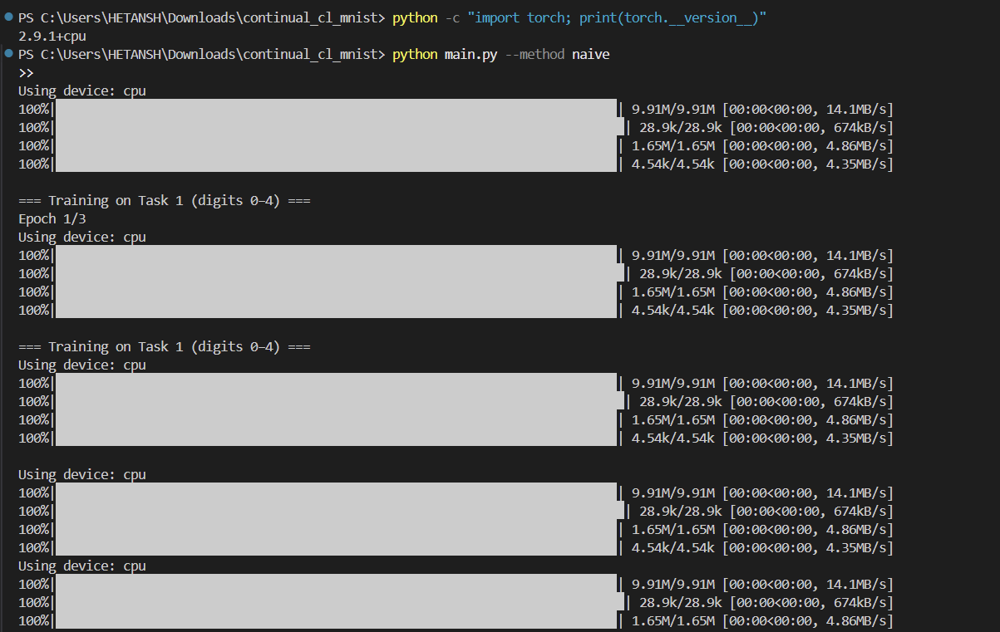
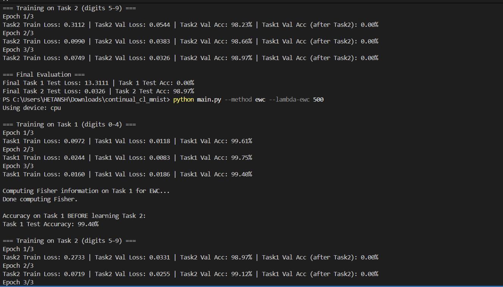
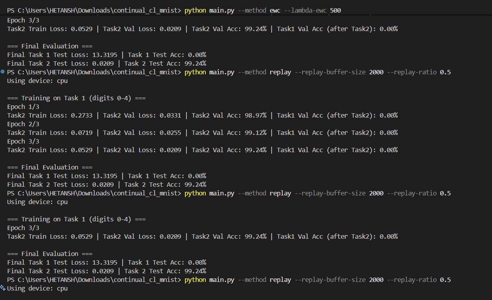
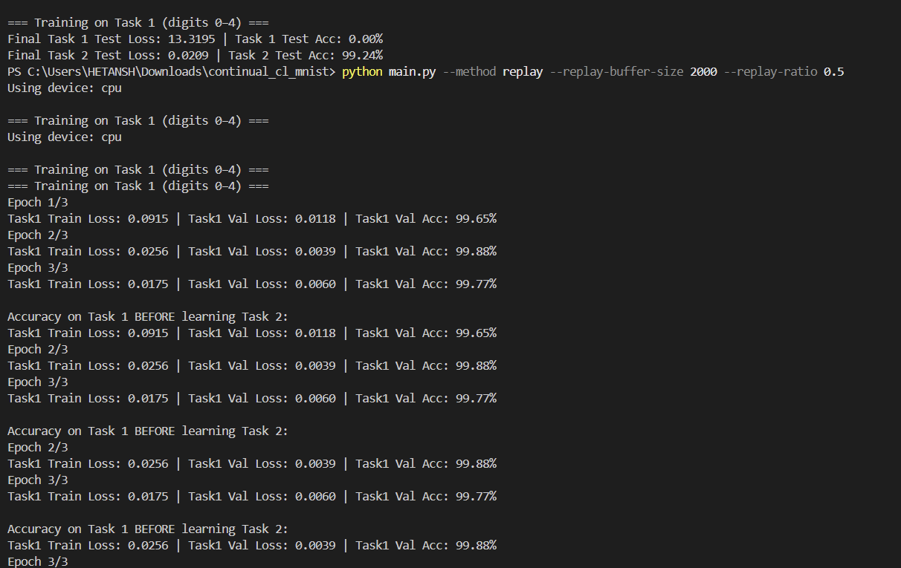
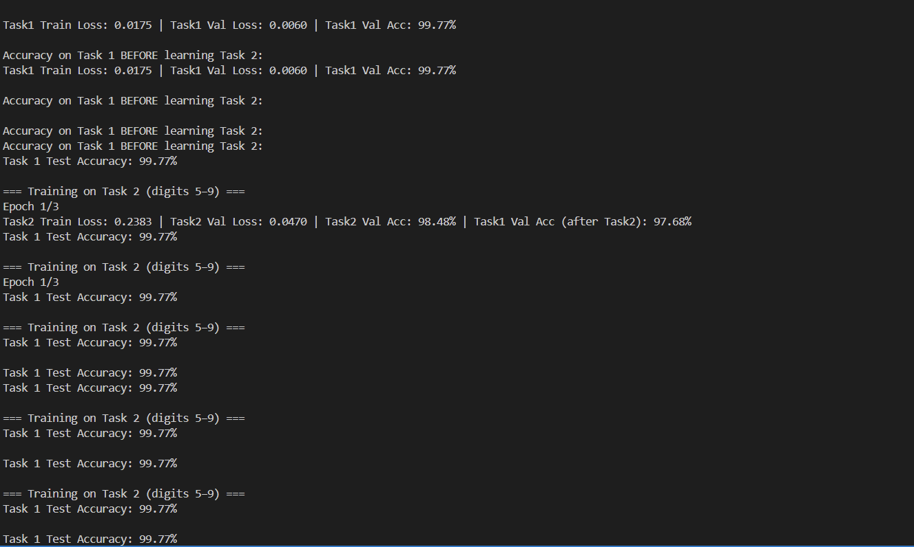

# Continual Learning for Image Classification (Split-MNIST)

This project explores **continual learning** on the classic **Split-MNIST** benchmark using three different training strategies:

- **Naive fine-tuning** (baseline)
- **Elastic Weight Consolidation (EWC)**
- **Replay Buffer (Experience Replay)**

The goal is to show how neural networks **forget old tasks** when trained sequentially (catastrophic forgetting), and how replay-based methods can reduce that forgetting.

---







## 1. Problem Setup

We split the MNIST dataset into two sequential tasks:

- **Task 1:** classify digits **0–4**  
- **Task 2:** classify digits **5–9**

The model is trained on **Task 1 first**, then on **Task 2**.  
We monitor how accuracy on **Task 1** changes *before and after* learning Task 2.

A small CNN (defined in `models.py`) is used as the backbone classifier.

---

## 2. Methods Implemented

### 2.1 Naive Fine-Tuning (`--method naive`)

- Train on Task 1 normally.
- Then continue training on Task 2 only.
- This usually causes **catastrophic forgetting**: performance on Task 1 drops to ~0%.

In your run, this is exactly what happened:

- Task 1 accuracy **before Task 2:** ~**99.6%**
- Task 1 accuracy **after Task 2:** **0.0%**
- Task 2 accuracy after training: ~**99%**

---

### 2.2 Elastic Weight Consolidation – EWC (`--method ewc`)

- After training on Task 1:
  - Estimate **Fisher information** (importance of each parameter).
  - Store a copy of the parameters θ\*.
- While training on Task 2:
  - Add an **EWC penalty** that discourages changing parameters that were important for Task 1.


I ran: ```bash
python main.py --method ewc --lambda-ewc 500


-> Replay Buffer / Experience Replay (--method replay)

While training on Task 1, store a subset of images/labels in a replay buffer.

During Task 2 training:

Each batch mixes new Task 2 samples with old Task 1 samples from the buffer.
This helps the model retain performance on Task 1 while still learning Task 2.

You ran: python main.py --method replay --replay-buffer-size 2000 --replay-ratio 0.5


Your observed results:

Task 1 accuracy before Task 2: ~99.8%
Task 1 accuracy after Task 2: ~98.4%
Task 2 accuracy after training: ~99.0%

So replay dramatically reduced forgetting compared to naive fine-tuning and EWC (with current settings).


3. Project Structure
continual_cl_mnist/
├── data_module.py    # Split-MNIST dataloaders (Task 1: 0–4, Task 2: 5–9)
├── ewc.py            # Fisher information + EWC loss implementation
├── main.py           # Experiment entry point and training loop
├── models.py         # Simple CNN for MNIST
├── replay.py         # ReplayBuffer class
├── requirements.txt  # Python dependencies
└── README.md         # (this file)


4. How to Run (Commands Used)

From the project folder:

1. (Optional) Install dependencies : pip install -r requirements.txt


2. Naive fine-tuning (baseline): python main.py --method naive

3. EWC : python main.py --method ewc --lambda-ewc 500

4. Replay buffer : python main.py --method replay --replay-buffer-size 2000 --replay-ratio 0.5


On first run, MNIST is downloaded automatically.

-Naive fine-tuning learns the new task well but completely forgets the old one (0% accuracy on Task 1 after Task 2).

-EWC (with current hyperparameters) preserves Task 2 accuracy but still suffers from forgetting on Task 1.

-Replay buffer keeps performance high on both tasks (≈98–99% on Task 1 and Task 2), showing a clear reduction in catastrophic forgetting.

-> This project demonstrates a full, working pipeline for continual learning on Split-MNIST using PyTorch
